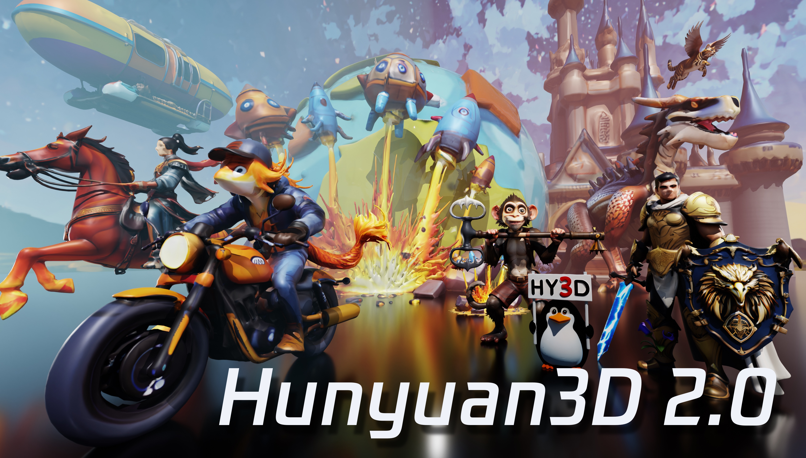
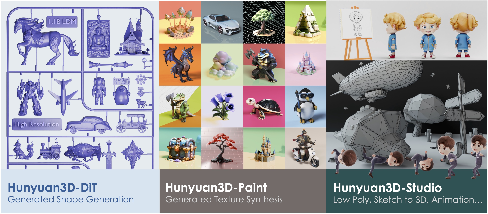
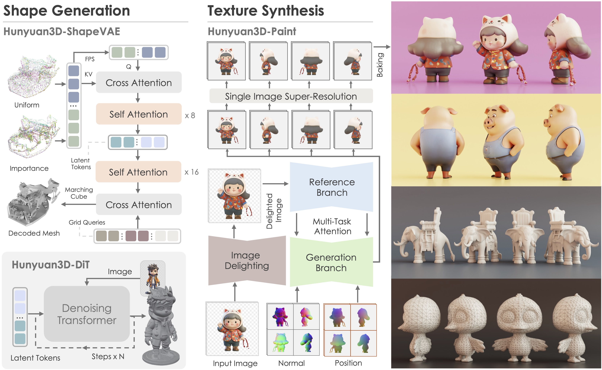

[Read in English](README.md)
[](README_ja_jp.md)

<p align="center">
  

</p>

<div align="center">
  <a href=https://3d.hunyuan.tencent.com target="_blank"></a>
  <a href=https://huggingface.co/spaces/tencent/Hunyuan3D-2  target="_blank"></a>
  <a href=https://huggingface.co/tencent/Hunyuan3D-2 target="_blank"></a>
  <a href=https://3d-models.hunyuan.tencent.com/ target="_blank"></a>
  <a href=https://discord.gg/dNBrdrGGMa target="_blank"></a>
  <a href=https://arxiv.org/abs/2501.12202 target="_blank"></a>
  <a href=https://x.com/txhunyuan target="_blank"></a>
</div>

[//]: # (  <a href=# target="_blank"></a>)

[//]: # (  <a href=# target="_blank"></a>)

[//]: # (  <a href="#"></a>)

<br>

> !


>  **[](#)** and **[Discord ](https://discord.gg/dNBrdrGGMa)** ,.

| Wechat Group                                     | Xiaohongshu                                           | X                                           | Discord                                           |
| ------------------------------------------------ | ----------------------------------------------------- | ------------------------------------------- | ------------------------------------------------- |
|  |  |  |  |

---

<br>
<p align="center">
" 3D
</p>

##

- Jul 26, 2025:  3D [HunyuanWorld-1.0](https://github.com/Tencent-Hunyuan/HunyuanWorld-1.0)!
- Jun 13, 2025:  3D [Hunyuan3D 2.1](https://github.com/Tencent-Hunyuan/Hunyuan3D-2.1)!
- Feb 14, 2025:  ,[](minimal_demo.py).
- Jan 27, 2025:   Blender ,[](#blender-addon).
- Jan 23, 2025:   [Windows ](https://github.com/YanWenKun/Hunyuan3D-2-WinPortable), ComfyUI  [ComfyUI-Hunyuan3DWrapper](https://github.com/kijai/ComfyUI-Hunyuan3DWrapper), [ComfyUI-3D-Pack](https://github.com/MrForExample/ComfyUI-3D-Pack)  [](#community-resources).
- Jan 21, 2025:   [Hunyuan3D Studio](https://3d.hunyuan.tencent.com) 3D!
- Jan 21, 2025:   [Hunyuan3D 2.0](https://huggingface.co/tencent/Hunyuan3D-2).
- Jan 21, 2025:   [Hunyuan3D 2.0](https://huggingface.co/spaces/tencent/Hunyuan3D-2). !

##

 3D 2.0  3D ,3D: —  3D-DiT, —  3D-Paint
,,
,AI
, 3D ,, 3D 3D,
, 3D 2.0

<p align="center">
  
</p>

##  Hunyuan3D 2.0

###

 3D 2.0 ,,,

<p align="left">
  
</p>

###

 3D 2.0  3D
, 3D , 3D 2.0

| Model                   | CMMD()   | FID_CLIP() | FID()      | CLIP-score() |
| ----------------------- | --------- | ----------- | ----------- | ------------- |
| Top Open-source Model1  | 3.591     | 54.639      | 289.287     | 0.787         |
| Top Close-source Model1 | 3.600     | 55.866      | 305.922     | 0.779         |
| Top Close-source Model2 | 3.368     | 49.744      | 294.628     | 0.806         |
| Top Close-source Model3 | 3.218     | 51.574      | 295.691     | 0.799         |
| Hunyuan3D 2.0           | **3.193** | **49.165**  | **282.429** | **0.809**     |

 Hunyuan3D 2.0 :
<p align="left">
  
  
</p>

###

|                |    |  | Huggingface                                                                         |
| ---------------------- | ---------- | ---- | ----------------------------------------------------------------------------------- |
| Hunyuan3D-DiT-v2-0     | 2025-01-21 | 2.6B | [](https://huggingface.co/tencent/Hunyuan3D-2)                                  |
| Hunyuan3D-Paint-v2-0   | 2025-01-21 | 1.3B | [](https://huggingface.co/tencent/Hunyuan3D-2)                                  |
| Hunyuan3D-Delight-v2-0 | 2025-01-21 | 1.3B | [](https://huggingface.co/tencent/Hunyuan3D-2/tree/main/hunyuan3d-delight-v2-0) |

##  Hunyuan3D 2.0

, Gradio  3D 2.0

- [](#)
- [Gradio](#gradio-app-)
- [API](#api-)
- [Blender](#blender-)
- [](#)

###

 PyTorch

```bash
pip install -r requirements.txt

# for texture

cd hy3dgen/texgen/custom_rasterizer
python3 setup.py install
cd ../../..
cd hy3dgen/texgen/differentiable_renderer
python3 setup.py install

```text

###

 diffusers  API  —  3D-DiT  —  3D-Paint
  3D-DiT:

```python
from hy3dgen.shapegen import Hunyuan3DDiTFlowMatchingPipeline

pipeline = Hunyuan3DDiTFlowMatchingPipeline.from_pretrained('tencent/Hunyuan3D-2')
mesh = pipeline(image='assets/demo.png')[0]

```text

 Trimesh , glb/obj()
  3D-Paint,:

```python
from hy3dgen.texgen import Hunyuan3DPaintPipeline
from hy3dgen.shapegen import Hunyuan3DDiTFlowMatchingPipeline

## let's generate a mesh first

pipeline = Hunyuan3DDiTFlowMatchingPipeline.from_pretrained('tencent/Hunyuan3D-2')
mesh = pipeline(image='assets/demo.png')[0]

pipeline = Hunyuan3DPaintPipeline.from_pretrained('tencent/Hunyuan3D-2')
mesh = pipeline(mesh, image='assets/demo.png')

```text

 [minimal_demo.py](minimal_demo.py) ,  3D

### Gradio App

Gradio:

```bash
python3 gradio_app.py

```text

### API

API,/3D

```bash
python api_server.py --host 0.0.0.0 --port 8080

```text

A demo post request for image to 3D without texture.

```bash
img_b64_str=$(base64 -i assets/demo.png)
curl -X POST "http://localhost:8080/generate" \

     -H "Content-Type: application/json" \
     -d '{

           "image": "'"$img_b64_str"'",
         }' \

     -o test2.glb

```text

### Blender

API,[Blender](blender_addon.py)Blender3D 2.0

https://github.com/user-attachments/assets/8230bfb5-32b1-4e48-91f4-a977c54a4f3e

###

,[ 3D](https://3d.hunyuan.tencent.com)

##

- [x]
- [x]
- [x]
- [ ] ComfyUI
- [ ] TensorRT

##

,:

```bibtex
@misc{hunyuan3d22025tencent,
    title={Hunyuan3D 2.0: Scaling Diffusion Models for High Resolution Textured 3D Assets Generation},
    author={Tencent Hunyuan3D Team},
    year={2025},
    eprint={2501.12202},
    archivePrefix={arXiv},
    primaryClass={cs.CV}
}

@misc{yang2024hunyuan3d,
    title={Hunyuan3D 1.0: A Unified Framework for Text-to-3D and Image-to-3D Generation},
    author={Tencent Hunyuan3D Team},
    year={2024},
    eprint={2411.02293},
    archivePrefix={arXiv},
    primaryClass={cs.CV}
}

```text

##

: [DINOv2](https://github.com/facebookresearch/dinov2), [Stable Diffusion](https://github.com/Stability-AI/stablediffusion), [FLUX](https://github.com/black-forest-labs/flux), [diffusers](https://github.com/huggingface/diffusers), [HuggingFace](https://huggingface.co), [CraftsMan3D](https://github.com/wyysf-98/CraftsMan3D),  [Michelangelo](https://github.com/NeuralCarver/Michelangelo/tree/main) ,

## Star

<a href="https://star-history.com/#Tencent/Hunyuan3D-2&Date">
 <picture>
   <source media="(prefers-color-scheme: dark)" srcset="https://api.star-history.com/svg?repos=Tencent/Hunyuan3D-2&type=Date&theme=dark" />
   <source media="(prefers-color-scheme: light)" srcset="https://api.star-history.com/svg?repos=Tencent/Hunyuan3D-2&type=Date" />
   
 </picture>
</a>
